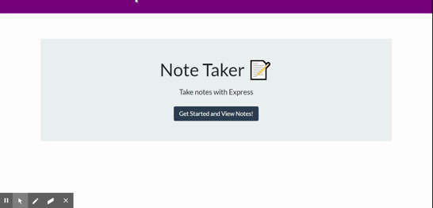
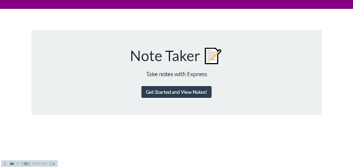
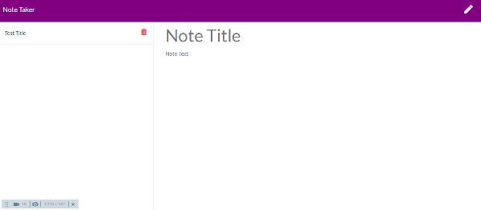

# Note-Taker
live-link: https://enigmatic-spire-35900.herokuapp.com/ 

## Table of contents
- [Description](#Description)
- [Technologies Used](#Technologies-Used:)
- [Installation](#Installation)
- [Usage Notes](#Usage-Notes)
- [Created By](#Created-By:)

## Description
an app to create, delete and save notes that are saved to a json file inside the directory 

## Technologies Used:

## Installation
GitHub Repository: https://github.com/MrDawit/Note-Taker 
* Go to the app's live link! \
live-link: https://enigmatic-spire-35900.herokuapp.com/ 

* If downloading the package, 
#### NPM I installs the following:

## Usage Notes
* In the middle of the page, click on "Get Started and View Notes!" button
* Create a "Note Title" and add "Note Text" to that note
* Now the app will allow you to save your note by pressing the save icon(floppy disk icon) on the top-righthand corner
* To view your saved notes, click on their Note Titles's that are saved on  the lefthand side
* To delete any note, click on the trashcan icon to the right of the saved Note Title
* To create a new note, while a note is being viewed, users can click the pencil icon on the top-righthand corner 
## Created By:
Shalom Dawit\
LinkedIn:https://www.linkedin.com/in/shalom-dawit-a0a5a4126 \
GitHub:https://github.com/MrDawit \
Email:Shalom.Dawit@gmail.com 